# Xinyao Zhang

Software engineer at [Bloomberg LP](https://www.bloomberg.com/company/), based in New York.

I build and support big-data ETL and processing systems. Most of my day-to-day work is in Java and Python across distributed storage, streaming, and compute.

Outside work, I'm interested in AI agents, CI/CD, developer experience, open source, and distributed systems.

## Tech stack

| Area | Technologies |
| --- | --- |
| Languages |   |
| Storage |   |
| Processing |   |
| Streaming |  |
| Tooling |  |

## Repositories

| Repository | Organization | What it does |
| --- | --- | --- |
| [Apache Airflow](https://github.com/apache/airflow) | [Apache Software Foundation](https://github.com/apache) | A platform for developing, scheduling, and monitoring batch workflows |
| [Sleeper](https://github.com/gchq/sleeper) | [GCHQ](https://github.com/gchq) | A serverless key-value store for large volumes of data stored in Amazon S3 |
| [Fineract Backoffice UI](https://github.com/apache/fineract-backoffice-ui) | [Apache Software Foundation](https://github.com/apache) | An Angular back-office interface for Apache Fineract, an open source core banking platform |

## GitHub activity

